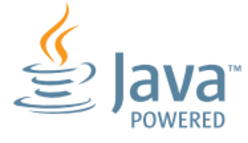

# HYF Individual Project; Personal Home Page

## I am Erkam.

### The web page will contain details about me

I am from _Turkey_ and I live in **_Belgium_**.

- 🔭 I’m currently working on HYF assignments
- 🌱 I’m currently learning Javascript

- Things I like (to do)
  - :speedboat:
  - :rocket:
  - :sailboat:
  - :tent:
  - :coffee:
  - :pizza:
  - ...

### Languages and Tools:

<!--  -->

<!--  -->
<!--  -->

<!--  -->

<!--  -->
<!--  -->

<!--
**erkamguresen/erkamguresen** is a ✨ _special_ ✨ repository because its `README.md` (this file) appears on your GitHub profile.

Here are some ideas to get you started:

- 🔭 I’m currently working on ...
- 🌱 I’m currently learning ...
- 👯 I’m looking to collaborate on ...
- 🤔 I’m looking for help with ...
- 💬 Ask me about ...
- 📫 How to reach me: ...
- 😄 Pronouns: ...
- ⚡ Fun fact: ...
-->
